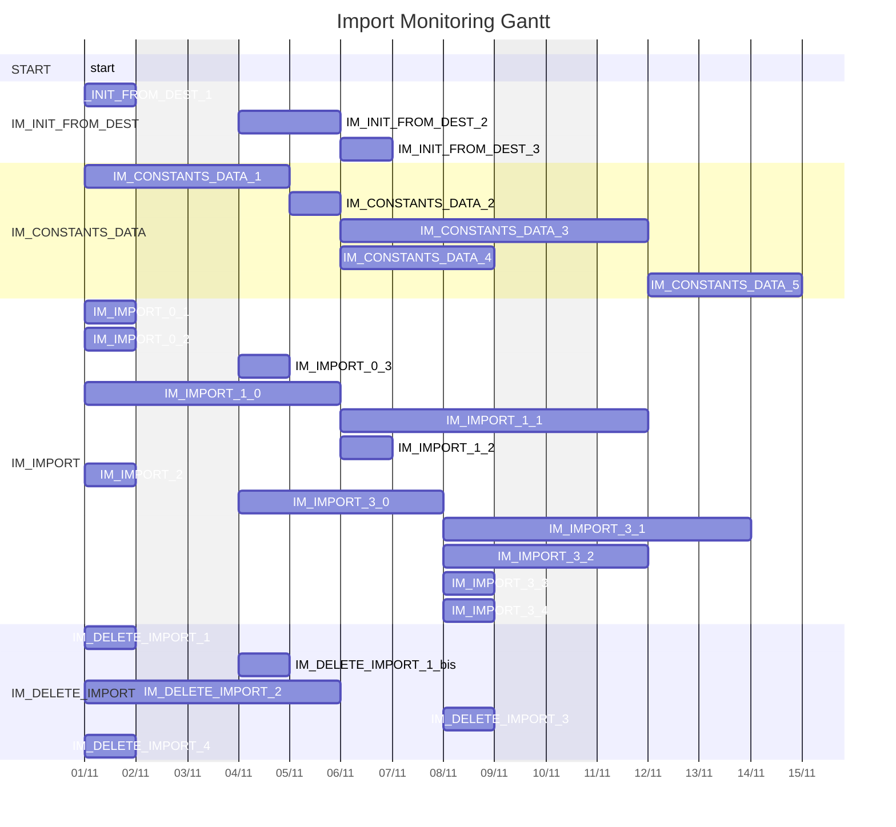

GeoNature
=========

```mermaid
gantt
title Import Monitoring Gantt
dateFormat DD/MM/YYYY
axisFormat %d/%m
excludes weekends

section START
    start :s, 01/11/2024, 0d

section IM_INIT_FROM_DEST
    IM_INIT_FROM_DEST_1  :ifd1, after s, 1d
    IM_INIT_FROM_DEST_2  :ifd2, after ifd1, 2d
    IM_INIT_FROM_DEST_3  :ifd3, after ifd2, 1d

section IM_CONSTANTS_DATA
    IM_CONSTANTS_DATA_1  :cd1, after s, 2d
    IM_CONSTANTS_DATA_2  :cd2, after cd1, 1d
    IM_CONSTANTS_DATA_3  :cd3, after cd2, 4d
    IM_CONSTANTS_DATA_4  :cd4, after cd2, 3d
    IM_CONSTANTS_DATA_5  :cd5, after cd4 cd3, 3d

section IM_IMPORT
    IM_IMPORT_0_1 :i0_1, after s, 1d
    IM_IMPORT_0_2 :i0_2, after s, 1d
    IM_IMPORT_0_3 :i0_3, after i0_2, 1d
    IM_IMPORT_1_0 :i1_0, after s, 3d
    IM_IMPORT_1_1 :i1_1, after i1_0, 4d
    IM_IMPORT_1_2 :i1_2, after i1_0, 1d
    IM_IMPORT_2 :i2, after s, 1d
    IM_IMPORT_3_0 :i3_0, after i0_1, 4d
    IM_IMPORT_3_1 :i3_1, after i3_0, 4d
    IM_IMPORT_3_2 :i3_2, after i3_0 i0_3, 2d
    IM_IMPORT_3_3 :i3_3, after i3_0 i0_3, 1d
    IM_IMPORT_3_4 :i3_4, after i3_0, 1d

section IM_DELETE_IMPORT
    IM_DELETE_IMPORT_1  :di1, after s, 1d
    IM_DELETE_IMPORT_1_bis  :di1b, after di1, 1d
    IM_DELETE_IMPORT_2  :di, after s, 3d
    IM_DELETE_IMPORT_3  :di3, after di1b di2 i3_0, 1d
    IM_DELETE_IMPORT_4  :di4, after s, 1d
```
