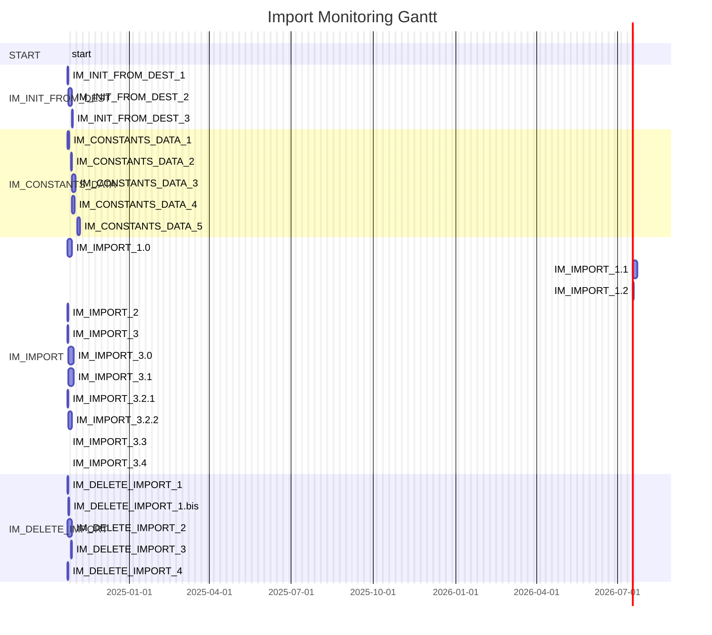

GeoNature
=========

```mermaid
gantt
title Import Monitoring Gantt
dateFormat DD/MM/YYYY
excludes weekends

section START
    start :s, 24/10/2024, 0d

section IM_INIT_FROM_DEST
    IM_INIT_FROM_DEST_1  :ifd1, after s, 0.5d
    IM_INIT_FROM_DEST_2  :ifd2, after ifd1, 1.5d
    IM_INIT_FROM_DEST_3  :ifd3, after ifd2, 0.5d

section IM_CONSTANTS_DATA
    IM_CONSTANTS_DATA_1  :cd1, after s, 2d
    IM_CONSTANTS_DATA_2  :cd2, after cd1, 1d
    IM_CONSTANTS_DATA_3  :cd3, after cd2, 4d
    IM_CONSTANTS_DATA_4  :cd4, after cd2, 3d
    IM_CONSTANTS_DATA_5  :cd5, after cd4 cd3, 3d

section IM_IMPORT
    IM_IMPORT_1.0  :i1.0, after s, 2.5d
    IM_IMPORT_1.1 :i1.1, after i1.0, 4d
    IM_IMPORT_1.2 :i1.2, after i1.0, 1d
    IM_IMPORT_2 :i2, after s, 0.5d
    IM_IMPORT_3 :i3, after s, 1d
    IM_IMPORT_3.0 :i3.0, after i3, 4d
    IM_IMPORT_3.1 :i3.1, after i3.0, 4d
    IM_IMPORT_3.2.1 :i3.2.1, after s, 1d
    IM_IMPORT_3.2.2 :i3.2.2, after i3.2.1, 1.5d
    IM_IMPORT_3.3 :i3.3, after i3.2.1, 0.5
    IM_IMPORT_3.4 :i3.4, after i3.0, 0.5

section IM_DELETE_IMPORT
    IM_DELETE_IMPORT_1  :di1, after s, 0.5d
    IM_DELETE_IMPORT_1.bis  :di1b, after di1, 1d
    IM_DELETE_IMPORT_2  :di, after s, 2.5d
    IM_DELETE_IMPORT_3  :di3, after di1b di2 i3.0, 0.5d
    IM_DELETE_IMPORT_4  :di4, after s, 0.5d
```
